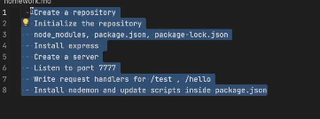
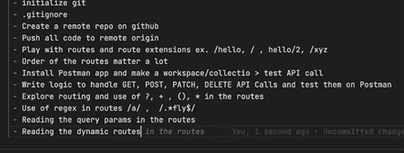
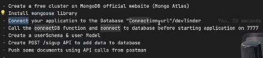
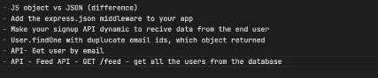
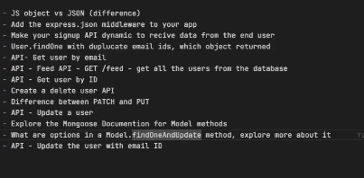
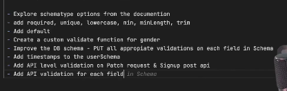
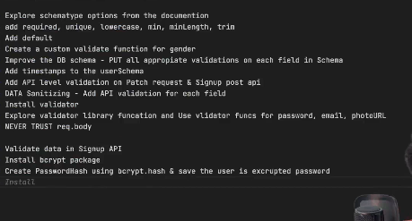

# Dependencies - any package on which project is dependent

Homework - 

  difference between caret and tilda (^ vs ~)
  what are dependencies
  what is the use of -g while npm install
  new hw is 

  Work done on 11-12-2025

  diff between query selectroa nd query selector all on stck overflow article read
  read importance of schema in moongoose docs and comet used for understanding
  also i read the uber blog for Schemaless part 1
  remaining  part 2 and part 3

DB HOMEWORK - 

Error Handlng usng - TRy and Catch
dFFERENCE BTW JS OBJECT AND JSON
ADD the express.json middleware to your app

home wor 14 dec :
Homewor 15 dec:

17 dec:
18 dec: 

<!--  install cookie parser first then send a duumy cookie to user 
3. create GEt/profikle paisend the cookie back
4.install  web token and
5.in login api after email and password validatioon create a jwt token and send it back to user inside cookies 
6. read rthe cookies inside your profile api and find the login in user  -->